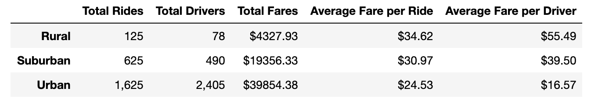
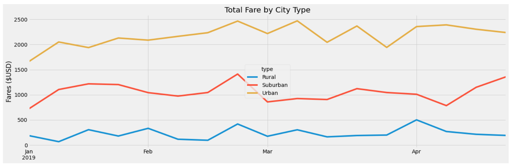

# PyBer_Analysis

## Overview of the Analysis:
Overview of the analysis: Explain the purpose of the new analysis.

The purpose of this analysis was to get an overall view of the ride-sharing data from a city type aspect. This was done by creating a DataFrame and then a multiple-line graph demonstrating the results of fares by city type for each week. This analysis has been greated to give PyBer a more detailed view as to how different city types affect fares, and could affect future decisions by the company.

## Results of the Analysis:
Results: Using images from the summary DataFrame and multiple-line chart, describe the differences in ride-sharing data among the different city types.

Based on the summary DataFrame, we can see that Urban areas are by far the busiest with over 1,625 total rides within a given time. These rides are split amongst 2,405 drivers. Although this is so, these drivers on average do not make the most money, they actually make the least out of the city types of rural, suburban, and urban. The city type that makes the most money are those in the Rural locations. They have the fewest rides of all along with the fewest drivers, but for each individual driver, it all balances to them making the most income within the same time frame as the Suburban and Urban sity types. This, however is not expressed in the multiple line chart.

In the multi-line chart, the city type that makes the most money within a particular city-type is shown over a specific time period such as from January to April. So, based off of this chart, we can see that PyBer makes the bulk of their money within Urban areas. The drivers do not benefit as much because there are so many of them, and likely due to short distant trips, the fares aren't that much on average per driver. In other words it appears safe to assume that the longer the ride the more money a driver makes. 

Based on both the DataFrame and the multi-line chart, the following assumptions can be made:

    - Longer rides: Rural > Suburban > Urban 
    - More rides: Urban > Suburban > Urban
    - More drivers: Urban > Suburban > Rural

## Summary of the Analysis:

After analyzing the data and taking time to understand its results, the following recommendations can be made to PyBer:

### Major recommendation:

- Do a survey of rural, suburban, and urban passengers and drivers by requesting their "wishlist" of PyBer in their area. Make sure they identify the type of      area in which they frequent PyBer / main purpose of using PyBer. To better recieve survey feedback, we can center it around a Christmas theme. If we are in       summer, it can be a "Christmas in July" PyBer wishlist, otherwise we get it moving as Christmas nears. For anyone that fills it out, they get credit for         their very next ride. W can ask them to fill it out on the app during their live PyBer ride to ensure that they complete it. Nothing too long. 
    
**Additional recommendations that implement the major recommendation:

- In regard to Rural areas, we can consider zoning in on establishing a schedule system in the app for drivers where they can open their schedules as "ready  to drive" and a rider can book a time slot. The driver will have a count down to start driving and then get on route with an ETA given to the rider, of           course. If the driver is 10+ min late on the original ETA for a scheduled ride, the rider will be given a choice to continue to wait or book from a list of       drivers who are closer to them to take over their ride. We can only assume that passengers wait a long time for their driver to arrive considering how           spread out Rural areas typically are. We can also assume that drivers waste a lot of gas driving around with so few people in the area. We can also assume       that cancellation fees hit our drivers hard in these areas. In the end, we do not know unless we ask (the wishlist survey). In the mean time it would be a good idea to hypothesize these issues and begin working on solutions. Adjusting the app for On-Demand or Scheduled rides is an idea to make rural pickups more predictable and flexible for both party's needs (the driver and the rider), but once again, we must ensure those needs are valid through the survey.

- In regard to Surburban areas, being that they are still their own category that falls in between Rural and Urban, let us find out what special circumstances they are most likely to encounter for their areas and approach them. We can assume that many suburban households utilize PyBer to commute back and forth downtown between home and jobs. Let us find out their wish list and zone in to making PyBer special for our "suburb 2 city 2 suburb" clientele. Perhaps we can adjust the app to where they can bookmark a driver that they like/trust, and get on their daily schedule.
    
- For our most consistent drivers with consistent schedules, we can utilize this as a pathway to building a daily route of passengers, either pools or individulas, for riders to minimize the interaction of strangers/random drivers and maximize a more steady income for drivers on certain periods in the day - particularly mornings and evenings. The rates on these rides can be slightly increased due to the privilege of having a familar face on a steady basis. 

- Lastly, in regard to our Urban areas, where there are so many drivers, but so much need in short distances, we could put the app feature of bookmarking drivers to the ultimate test. If a favored driver is in the area, riders can select them easily, while new riders and new drivers can be matched accordingly. In the long run, with many people pairing with their selected drivers, it could ease a lot of confusion and congestion in downtown areas. More people will know what car they are looking for and probably already have meet up places established, rather than random locations that block traffic. It may take stress off of our programming system because many drivers will already be pre-mapped to a client. Also in the long-term, as there is more consistency with repeated riders to drivers, and the scheduling capabilities for drivers take effect, building more predictable shifts and income experiences, we could see a significant build up of long-term drivers and a much more organized system both internally and externally, compared to our chaotic competitors. 
    
For all of these to come in to play, we must first determine whether or not this is something our drivers and riders are interested in, so let's request those wishlists!
